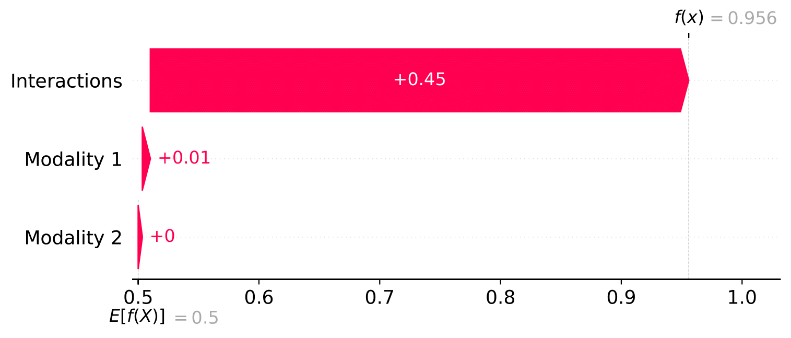

# InterSHAP - Quantifying Cross-modal Interactions in Multimodal Machine Learning 

We present InterSHAP, a cross-modal interaction score, that can be used for an arbitrary number of modalities, is local, performance agnostic, and operates on unlabelled data. We are the first, to the best of our knowledge, to use the Shapley interaction index [(Grabisch and Roubens, 1999)](https://econpapers.repec.org/article/sprjogath/v_3a28_3ay_3a1999_3ai_3a4_3ap_3a547-565.htm) to effectively separate cross-modal interactions from modality contributions. 
<p align="center">
  
</p>

This repository supports the following cross-modal interaction scores: 

- InterSHAP (Ours)
- [PID score](https://papers.nips.cc/paper_files/paper/2023/hash/575286a73f238b6516ce0467d67eadb2-Abstract-Conference.html)
- [EMAP](https://aclanthology.org/2020.emnlp-main.62.pdf) 
- [SHAPE](https://www.ijcai.org/proceedings/2022/0425.pdf)

Few approaches, such as [PID score](https://papers.nips.cc/paper_files/paper/2023/hash/575286a73f238b6516ce0467d67eadb2-Abstract-Conference.html), [EMAP](https://aclanthology.org/2020.emnlp-main.62.pdf) , and [SHAPE](https://www.ijcai.org/proceedings/2022/0425.pdf) have been developed to explore whether a model learns cross-modal interactions. While PID quantifies synergy within a dataset without considering the model, methods like EMAP calculate how a model would perform without cross-modal interactions. Additionally, SHAPE uses Shapley values to approximate cross-modal interactions. The table shows the limitations of the four approaches:

| Score            | Modalities $> 2$ | Local | Unsupervised | Performance Agnostic | Controlled Testing |
|------------------|-------------------|-------|--------------|----------------------|---------------------|
| [PID score](https://papers.nips.cc/paper_files/paper/2023/hash/575286a73f238b6516ce0467d67eadb2-Abstract-Conference.html)              | :x:               | :x:   | :x:          | <font color="green">:heavy_check_mark:</font>   | <font color="green">:heavy_check_mark:</font>  |
| [EMAP](https://aclanthology.org/2020.emnlp-main.62.pdf)              | :x:               | :x:   | :x:          | :x:                  | <font color="green">:heavy_check_mark:</font>  |
| [SHAPE](https://www.ijcai.org/proceedings/2022/0425.pdf)            | <font color="green">:heavy_check_mark:</font>| :x:   | :x:          | :x:                  | :x:                 |
| InterSHAP (Ours)| <font color="green">:heavy_check_mark:</font>| <font color="green">:heavy_check_mark:</font>| <font color="green">:heavy_check_mark:</font>| <font color="green">:heavy_check_mark:</font> | <font color="green">:heavy_check_mark:</font> |


- *Modalities $> 2$*: The score is effective for two or more modalities.
- *Local*: Besides its global application at the dataset level, it is also applicable at the data point level.
- *Unsupervised*: Ground truth labels are unnecessary to calculate the score.
- *Performance agnostic*: The degree of cross-modality interactions is not influenced by the model's performance, ensuring robustness.
- *Controlled testing*: The metric underwent rigorous testing for effectiveness using a synthetic dataset.
  
## Results
InterSHAP values are presented in percentages for both the baseline model (XOR) and the FCNN with early fusion on HD-XOR datasets. For the baseline model, the expected results are observed, affirming the functionality of the InterSHAP implementation. However, when considering the FCNN, slightly higher InterSHAP values are evident for uniqueness, accompanied by slightly lower values for the synergy setting. This indicates that the model deviates slightly from the baseline, a reflection also observed in the F1 scores. We cannot make statements regarding the expected behaviour of redundancy, and random settings. However, in the redundancy setting, the model relies on cross-modal interactions as well as modality contributions. The random setting illustrates that InterSHAP is performance-independent because it measures cross-model interaction, even if the model performance is not better than random.

|             | Uniqueness 1 | Uniqueness 2 | Synergy | Redundancy | Random |
|-------------|--------------|--------------|---------|------------|--------|
| XOR         | 0.0          | 0.2 ± 0.1    | 99.7    | -  | - |
| FCNN        | 0.2 ± 0.1    | 3.1 ± 0.4    | 98.0    | 38.6 ± 0.5  | 57.8 ± 1.1 |


# Visualisation
We designed InterSHAP to be compatible with the visualisation modules of the [SHAP](https://shap.readthedocs.io/en/latest/) implementation. The code for creating the plots can be found in `visualisation/plot.ipynb`.  The following figures illustrate the breakdown of the model behaviour on the HD-XOR data sets into its components. This representation uniquely shows the relevance of modalities in absolute numbers in addition to cross-modal interactions. 

1. These are examples shown in the form of a waterfall plot:

<p align="center">
  
  
  
</p>

2. These are examples shown in the form of a force plot:
<p align="center">
  
  
</p>

Our visualisation also has several other features: it can distinguish between predicted classes and be created for each individual data point. If there are more than two modalities, the user can choose whether to display interactions together or split them up per pair of modalities.

# Replicate Results 
To reproduce the results, you first create the synthetic datasets, then train the models, and finally evaluate the trained models on the test dataset.

 ## 1. Setup
   ```bash
   conda create --name interactions python=3.9
   conda activate interactions
   conda install --file requirements.txt
   ```


 ## 2. Generate Synthetic Data (HD-XOR)
To generate the synthetic datasets (settings: uniqueness 1, uniqueness 2, synergy, random and redundancy) with the HD-XOR method for the following scripts:
```bash
bash generate_data/generate_VEC2.sh PATH/TO/SAVE/
bash generate_data/generate_VEC3.sh PATH/TO/SAVE/
bash generate_data/generate_VEC5.sh PATH/TO/SAVE/
```

 ## 3. Train model
You can choose which  `--settings`  to consider and which concatenation method `--concat` ( <kbd style="background-color: lightgray;">early</kbd>,<kbd style="background-color: lightgray;">intermediate</kbd>, or <kbd style="background-color: lightgray;">late</kbd>) to use. 
The `--unimodal` flag additionally trains an FCNN on each modality individually. Change `--label` to <kbd style="background-color: lightgray;">VEC3XOR_</kbd>, <kbd style="background-color: lightgray;">VEC4XOR_</kbd> for three or four modalities, respectivly.

```bash
python main.py 
    --seeds 1 42 113 \
    --epochs 200 \ 
    --label VEC2XOR_ \ 
    --settings  uniqueness0 uniqueness1 synergy redundancy  \ 
    --concat early --train_uni_model --train
```
 ## 4. Eval model on cross-modal interactions
Specify the interaction scores you want to use with the `--synergy_metrics` flag. You can choose from  <kbd style="background-color: lightgray;">SHAPE</kbd>,  <kbd style="background-color: lightgray;">InterSHAP</kbd>, <kbd style="background-color: lightgray;">PID</kbd>, and  <kbd style="background-color: lightgray;">EMAP</kbd>. Additionally, indicate how many samples you want to evaluate with the `--n_samples_for_interaction` flag. 
Note that EMAP may take a considerable amount of time, whereas InterSHAP can comfortably evaluate several thousand data points.

```bash
python main.py 
    --seeds 1 42 113  \
    --n_samples_for_interaction 2000  \
    --epochs 200 --label VEC2XOR_  \
    --synergy_metrics SHAPE InterSHAP EMAP PID  \
    --settings synergy uniqueness0 redundancy uniqueness1  \
    --concat early 
```

## Mulitmodal Single Cell Datasets
```bash
python main.py 
    --seeds 1 42 113 \
    --n_samples_for_interaction 500 \
    --epochs 200 --label single-cell_ \
    --synergy_metrics SHAPE  InterSHAP EMAP PID \
    --settings all \
    --concat late \
    --train --train_uni_model  \
    --number_of_classes 4 \
    --data_path PATH/TO/DATA$
```
## MIMIC III
The MIMIC dataset has restricted access. To gain access to the preprocessed version of this dataset, please follow instructions [here](https://mimic.mit.edu/) to gain the necessary credentials. We used the prepocessed data from [MultiBench](https://github.com/pliang279/MultiBench?tab=readme-ov-file). Once you have the credentials, email yiweilyu@umich.edu with proof of your credentials and ask for the preprocessed 'im.pk' file. 

To create the correct format, execute: 
```bash
python generate_data/mimic.py 
    --save_path PATH/real_world_data \ 
    --imputed_path PATH/TO/im.pk \
    --task -1
```
You should have trained models on the MIMIC III dataset. Than you can evaluate the model for cross-modal interaction by running:

```bash
python main_mimic.py   \
    --n_samples_for_interaction 2000   \
    --label mimic_  \
    --synergy_metrics   InterSHAP  PID EMAP  \
    --settings taskmortality_2D  \
    --concat baseline   \
    --data_path PATH/real_world_data$  \
    --number_of_classes 6  \
    --pretrained_paths '/PATH/baseline_task1_seed1.pt' '/PATH/baseline_task1_seed2.pt' '/PATH/baseline_task1_seed3.pt'

```

# Apply InterSHAP to your own model

```
import torch
from synergy_evaluation.evaluation import eval_synergy
from utils.dataset import MMDataset

synergy_eval_metrics = ['SHAPE','InterSHAP','PID','EMAP'] #choose the one you want
save_path = $PATH
number_of_classes = $INT

val_dataset, test_dataset = $ LOAD DATA in MMDataset

device = 'cuda:0' if torch.cuda.is_available() else 'cpu'
model = torch.load(PATH)
model.to(device)

synergy_results = eval_synergy(model, val_dataset, test_dataset, device = device, eval_metrics=synergy_eval_metrics, batch_size=100, save_path=save_path, use_wandb=False, n_samples_for_interaction=10, classes = number_of_classes)
print(synergy_results)
```

